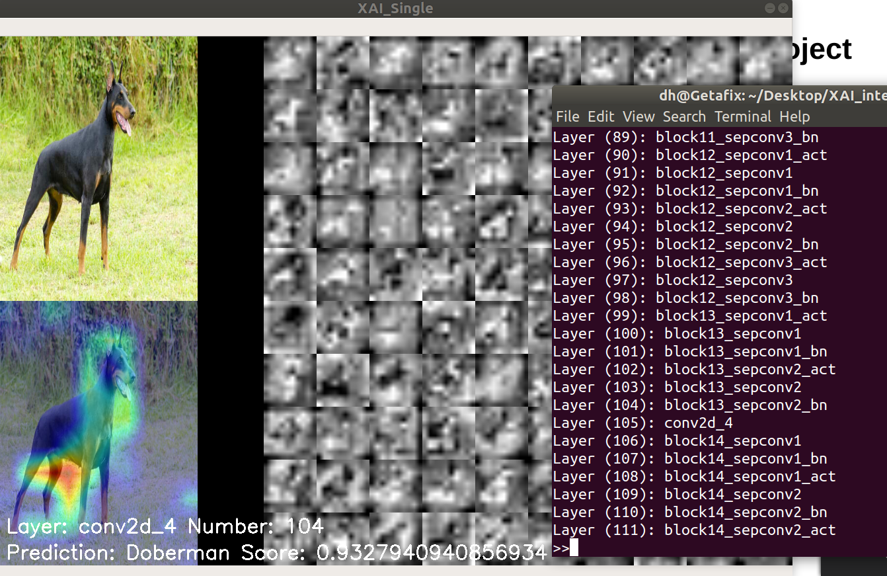

# XAI Project

This was a project done by me([@chuanhao01](https://github.com/chuanhao01)) and david([@David-The-Programmer](https://github.com/David-The-Programmer)) while we were interning at [DSTA](https://www.dsta.gov.sg/)  

## Description  
This project aims to help explain how a Convolutional Neural Network(CNN) makes its decision by visualizing the Class Activation Heatmap(CAM) of its hidden layers and the activations of each individual filter within that layer.  

Example of the program running:  
  

For more information on the project click [here --notdone]()


## Installation

#### For Ubuntu

**Prerequisites**:  

There are what you should have to run the program.
Note: The version numbers given are what I used to develop and test the application, but it should still work for updated versions of these libraries
```
python3 --version 3.6.8++ (I have not tested on other versions of python however it should work)
keras --version 2.2.4++ (Same for this)
tensorflow --version 1.13.1/1.14.0++ (I have tested this on both and it worked)
numpy --version 1.16.4++
opencv --version 4.1.0++
```

**To install**: 
```
sudo apt-get install python3
pip install numpy
pip install tensorflow
pip install keras
pip install opencv-python
cd folder_where_you_the_program_to_be
git clone https://github.com/chuanhao01/XAI_project
cd XAI_project
```

With this you should have downloaded all the neccsary libraries and should be able to run the tool.

## Usage

Currently the structure of the file is as such:  

Note: I have hidden some of files which are self explanatory.

```bash
XAI_Project
├─ CLI_stuff
│  └─ commands.txt
├─ Sample_Images
├─ old_files
├─ utils
│  ├─ __pycache__
│  ├─ drawer.py
│  ├─ xai_activations.py
│  ├─ xai_heatmap.py
│  └─ xai_tool.py
├─ .gitignore
├─ README.md
├─ multi.py
└─ single.py
```

The template code are in the files single.py and multi.py.  

The file single.py is a single threaded implementation meant for running on still images. The file multi.py is a multi threaded implementation of the tool, using video feed from a webcam.

Both files are using a pre-trained model on imagenet from the keras.application module.

Currently, both files are set-up to run