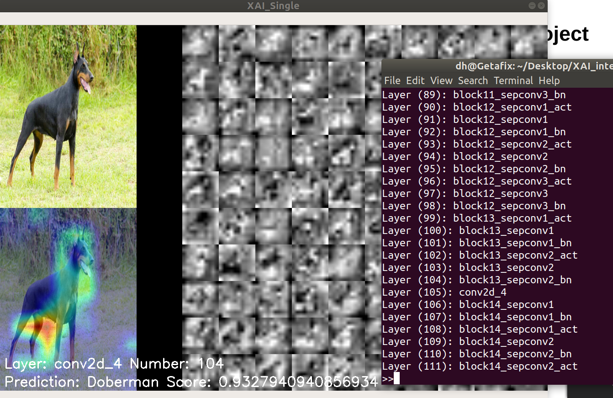

# XVis_Tool 

This was a project done by me([@chuanhao01](https://github.com/chuanhao01)) and david([@David-The-Programmer](https://github.com/David-The-Programmer)) while we were interning at [DSTA](https://www.dsta.gov.sg/)  

## Description  
This project aims to help explain how a Convolutional Neural Network(CNN) makes its decision by visualizing the Class Activation Heatmap(CAM) of its hidden layers and the activations of each individual filter within that layer.  

Example of the program running:  
  

For more information on the project click [here](https://github.com/chuanhao01/XVis_Tool/wiki)


## Installation

#### For Ubuntu

**Prerequisites**:  

There are what you should have to run the program.
Note: The version numbers given are what I used to develop and test the application, but it should still work for updated versions of these libraries
```
python3 --version 3.6.8++ (I have not tested on other versions of python however it should work)
keras --version 2.2.4++ (Same for this)
tensorflow --version 1.13.1/1.14.0++ (I have tested this on both and it worked)
numpy --version 1.16.4++
opencv --version 4.1.0++
```

**To install**: 
```
sudo apt-get install python3
pip install numpy
pip install tensorflow
pip install keras
pip install opencv-python
cd folder_where_you_the_program_to_be
git clone https://github.com/chuanhao01/XAI_project
cd XAI_project
```

With this you should have downloaded all the neccsary libraries and should be able to run the tool.

## Usage

Currently the structure of the file is as such:  

Note: I have hidden some of files which are self explanatory.

```bash
XAI_Project
├─ CLI_stuff
│  └─ commands.txt
├─ Sample_Images
├─ old_files
├─ utils
│  ├─ __pycache__
│  ├─ drawer.py
│  ├─ xai_activations.py
│  ├─ xai_heatmap.py
│  └─ xai_tool.py
├─ .gitignore
├─ README.md
├─ multi.py
└─ single.py
```

The template code for running the tool are in the files `single.py` and `multi.py`.  

The file `single.py` is a single threaded implementation meant for running on still images. The file `multi.py` is a multi threaded implementation of the tool, using video feed from a webcam.

Currently, both files are set-up to run on models pre-trained on imagenet imported from the `keras.applications` module.

Note: As the `single.py` file runs on still images, it is set up to look at one of the sample images for now.

If you want to adapt to code to run on other models, with different images, you can refer to the comments in the template code itself or look at our [wiki guide](https://github.com/chuanhao01/XVis_Tool/wiki).

To run the respective `single.py` or `multi.py` files, do:

```bash
python3 single.py

or

python3 multi.py
```

Side Note: If you have CUDA configured and are using `tensorflow --version 1.13.1` you may run into some errors starting CUDA. The soultion that worked for me was to set-up an enviroment variable before running the file.  
I did the following:  

```bash
TF_FORCE_GPU_ALLOW_GROWTH=true python3 multi.py
```

## Credits

Here are some of the papers and github repos we referenced while working on this project:  

Visualizing intermediate activation in Convolutional Neural Networks with Keras:  
[Github Repo](https://github.com/gabrielpierobon/cnnshapes)  
[Medium Article](https://towardsdatascience.com/visualizing-intermediate-activation-in-convolutional-neural-networks-with-keras-260b36d60d0)

[Keras-Class-Activation-Map](https://github.com/nickbiso/Keras-Class-Activation-Map)  

DeepVis: 
[Github Repo](https://github.com/yosinski/deep-visualization-toolbox)
[Website](http://yosinski.com/deepvis)
[Understanding Neural Networks Through Deep Visualization Paper](https://arxiv.org/abs/1506.06579)
[Link to the paper](http://yosinski.com/media/papers/Yosinski__2015__ICML_DL__Understanding_Neural_Networks_Through_Deep_Visualization__.pdf)

## License

MIT License

Copyright (c) 2019 Lim Chuan Hao

Permission is hereby granted, free of charge, to any person obtaining a copy
of this software and associated documentation files (the "Software"), to deal
in the Software without restriction, including without limitation the rights
to use, copy, modify, merge, publish, distribute, sublicense, and/or sell
copies of the Software, and to permit persons to whom the Software is
furnished to do so, subject to the following conditions:

The above copyright notice and this permission notice shall be included in all
copies or substantial portions of the Software.

THE SOFTWARE IS PROVIDED "AS IS", WITHOUT WARRANTY OF ANY KIND, EXPRESS OR
IMPLIED, INCLUDING BUT NOT LIMITED TO THE WARRANTIES OF MERCHANTABILITY,
FITNESS FOR A PARTICULAR PURPOSE AND NONINFRINGEMENT. IN NO EVENT SHALL THE
AUTHORS OR COPYRIGHT HOLDERS BE LIABLE FOR ANY CLAIM, DAMAGES OR OTHER
LIABILITY, WHETHER IN AN ACTION OF CONTRACT, TORT OR OTHERWISE, ARISING FROM,
OUT OF OR IN CONNECTION WITH THE SOFTWARE OR THE USE OR OTHER DEALINGS IN THE
SOFTWARE.
