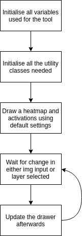

# Guiding Principles

What we had in mind as we developed the tool was to make the utility classes as flexible as possible. We went with the philosphy that the utility tools to create the heatmaps and activation should be able to adapt to neaerly any CNN model in keras.  

We also seperated the processing of the heatmaps and activations from drawing and processing the image.  

Lastly as we wanted the utility classes to be applied universally to any keras model, we went with creating more wrapper classes, that utilises lower level classes to create the final tool.  

As such some readability and code structure is comprimised at the hightest level.

A breif layout of the interaction between the classes: 
