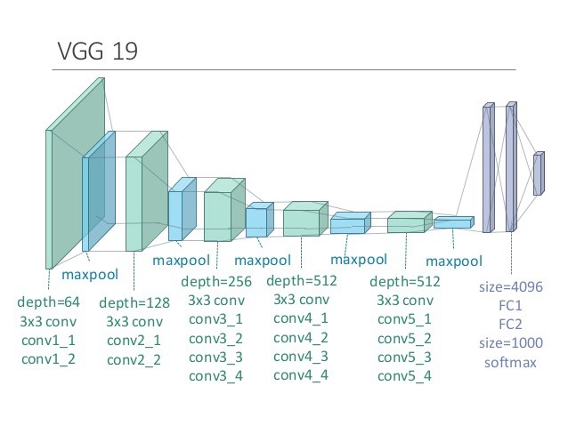
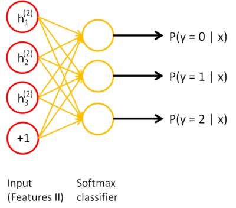
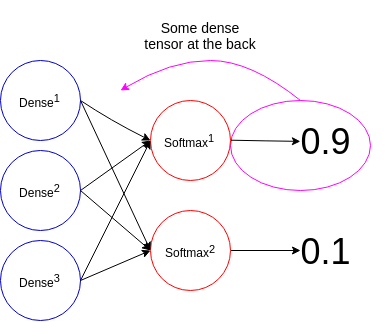

# XAI Heatmap

For this guide, it will be slightly different as I will be diving into the explanation of the code and theory. If you just want to know how to use the code, look at the code section. If you want to know the theory, look at the theory section.

### Going into the code

For a start, you can see that the class takes in 2 arguments when declared, a model and layers argument.

```python
class XAIHeatmap:
  def __init__(self, model, layers):
```

In this case, the layers variable we pass in is a list of all the conv layers names that we can generate a heatmap for. Usually, this is done for us in the `XVisTool` class by using a simple regex to get all names with conv in them.  

After this, to run the tool, all you need is a cv2 representation of the input image, the img tensor(after preprocessing and turning it into the batch form), and the layer number. The method `runTool` will return the heatmap superimposed onto the original cv2 in a numpy array.  

```python
  # High level wrapping function to run and get a heatmap
  def runTool(self, cv2img, img_tensor, layer_num):
```

And that's it for using this class to generate a heatmap.

### The theory

The theory for this might be a complex so I will be splitting this into 2 parts, *how do I get a heatmap* and *what the code is trying to do*.  

**How do i get a heatmap**

Firstly, let us look at a convolutional network architecture, using VGG19 as an example. 



As the image is passed through the network, it will eventually get to the final dense softmax layer, when the model will make its prediction. An example how that might look like is given below.  



As you can see, the dense layer before is fully connected to the softmax layer, and the softmax layer has multiple outputs.  

Going back to using VGG19 as an example, let's assume the network was trained on imagenet and had 1000 possible outputs out of the softmax layer and there was one output with the highest probability. We would take that as the prediction of the model.  

Then the question we would ask ourselves is, what contributed the most to the AI making that decision?

To answer this question we could get a heatmap of how much every region of the map contributed to activating their respective filters and in relation to the final predictions.  

To break it down, we first see what the model predicted. Then we can trace back to the tensor in the dense layer that contributed the most to that prediction. As seen in the graphic below:  

  

With this, we can then take any conv. layer in the CNN and calculate how much each region of each filter in the layer contributed to the final prediction.  

Then taking the mean of all filters in the layer, and scaling the outputs based on the maximum we can see calculate how much each region of the image contributed to the activations in the layer that lead to the prediction.  


### In practice(Coding the function)

In this part we will be going into the details of the code, using the above explanation as a foundation.

I will be linking a notebook I made that goes through more of the process in a notebook fashion [here](asadf).  

At a glance: 
```python
def camXAITool(self, cv2img, img_tensor, model, layer_name):
    # Getting the predictions from the model
    # preds is the coded preds 

    # Debugging time code
    import time
    tic = time.time()

    preds = model.predict(img_tensor)

    tic3 = time.time()
    
    # Getting the tensor of all weights of the final dense layer
    output = model.output
    # getting the indice/position of the weight that contributed the most to the classification
    argmax = np.argmax(preds[0])
    # isolating the weight that contributed the most to the classification in the output tensor
    output = output[:, argmax]
    # getting the conv_layer to apply the heatmap to
    conv_layer = model.get_layer(layer_name).output
    # Getting the gradients of the most activated weight w.r.t. the conv_layer
    # Also getting the mean of the gradients per feature map 
    grads = K.gradients(output, conv_layer)[0]
    pooled_grads = K.mean(grads, axis = (0, 1, 2))
    # Making the Keras function
    iterate = K.function([model.input], [pooled_grads, conv_layer])
    # Getting the pooled_grads and conv layer w.r.t. the input img
    pooled_grads_value, conv_layer_output_layer = iterate([img_tensor])
    for i in range(len(pooled_grads_value)):
      conv_layer_output_layer[0, :, :, i] *= pooled_grads_value[i]
    # Generating the heatmap based on the grads and conv_layer
    heatmap = np.mean(conv_layer_output_layer, axis=-1)[0]
    # Im still confused about the np.maximum funct
    heatmap = np.maximum(heatmap, 0)
    heatmap /= np.max(heatmap)

    tic4 = time.time()

    # Loading the img using cv2
    img = cv2img 
    # resizing and normalizing the heatmap
    heatmap = cv2.resize(heatmap, (img.shape[1], img.shape[0]))
    heatmap = np.uint8(heatmap * 255)
    # applying the heatmap
    heatmap = cv2.applyColorMap(heatmap, cv2.COLORMAP_JET)
    hif = 0.8
    superimposed_image = heatmap * hif + img
    superimposed_image /= np.max(superimposed_image)
    superimposed_image *= 255.

    tic5  = time.time()
    
    # print('forward pass: {}s'.format(tic3 - tic))
    # print('camming: {}s'.format(tic4 - tic3))
    # print('drawing: {}s'.format(tic5 - tic4))

    return superimposed_image  
```

Note: You can firstly ignore the tics as those were there when I was debugging the speed of each process in generating the heatmap.  

For this part, we are isolating the tensor responsible for that prediction in the variable `output`.

```python
    # Getting the tensor of all weights of the final dense layer
    output = model.output
    # getting the indice/position of the weight that contributed the most to the classification
    argmax = np.argmax(preds[0])
    # isolating the weight that contributed the most to the classification in the output tensor
    output = output[:, argmax]
```

We then also isolate the outputs of the conv. the layer we are trying to generate a heatmap for here.  

```python
    # getting the conv_layer to apply the heatmap to
    conv_layer = model.get_layer(layer_name).output
```

Then we user keras.backend to calculate the gradient of the final dense tensor output with respect to the conv. layer outputs. In this case, the gradients represent the relation of the conv. layer activations to the final predictions. The larger the gradient, the larger the contribution.  

We also calculate the mean gradient of all the values in the filter, stored in `pooled_grads`.  


```python
    # Getting the gradients of the most activated weight w.r.t. the conv_layer
    # Also getting the mean of the gradients per feature map 
    grads = K.gradients(output, conv_layer)[0]
    pooled_grads = K.mean(grads, axis = (0, 1, 2))
```

We then use the pooled gradients and conv. layers output to create a Keras backend function. We then run the input image tensor through the function in order to get the pool gradients and conv. layer outputs after the image are passed through.  

We lastly multiplied the filters by the pooled gradients of the layer, so the region which contributed the most to the activation scale proportionally.  


```python
    # Making the Keras function
    iterate = K.function([model.input], [pooled_grads, conv_layer])
    # Getting the pooled_grads and conv layer w.r.t. the input img
    pooled_grads_value, conv_layer_output_layer = iterate([img_tensor])
    for i in range(len(pooled_grads_value)):
      conv_layer_output_layer[0, :, :, i] *= pooled_grads_value[i]
```

Here we generate the heatmap of all the filters, by finding the mean of all filters, leaving us with a 2-D numpy array. Then we scale the mean values based on the maximum to get an evenly distributed heatmap.  


```python
    # Generating the heatmap based on the grads and conv_layer
    heatmap = np.mean(conv_layer_output_layer, axis=-1)[0]
    # Im still confused about the np.maximum funct
    heatmap = np.maximum(heatmap, 0)
    heatmap /= np.max(heatmap)
```

Then we scale the heatmap to the same size of the input image and superimpose the heatmap onto the image using `cv2.applyColorMap` method.  

Lastly, we return the superimposed image.  

```python
    # Loading the img using cv2
    img = cv2img 
    # resizing and normalizing the heatmap
    heatmap = cv2.resize(heatmap, (img.shape[1], img.shape[0]))
    heatmap = np.uint8(heatmap * 255)
    # applying the heatmap
    heatmap = cv2.applyColorMap(heatmap, cv2.COLORMAP_JET)
    hif = 0.8
    superimposed_image = heatmap * hif + img
    superimposed_image /= np.max(superimposed_image)
    superimposed_image *= 255.
    return superimposed_image  
```

And that's it. With this code, we can generate the heatmap, which shows the relation of a region of an image to its activation in the Neural Network that caused its prediction.